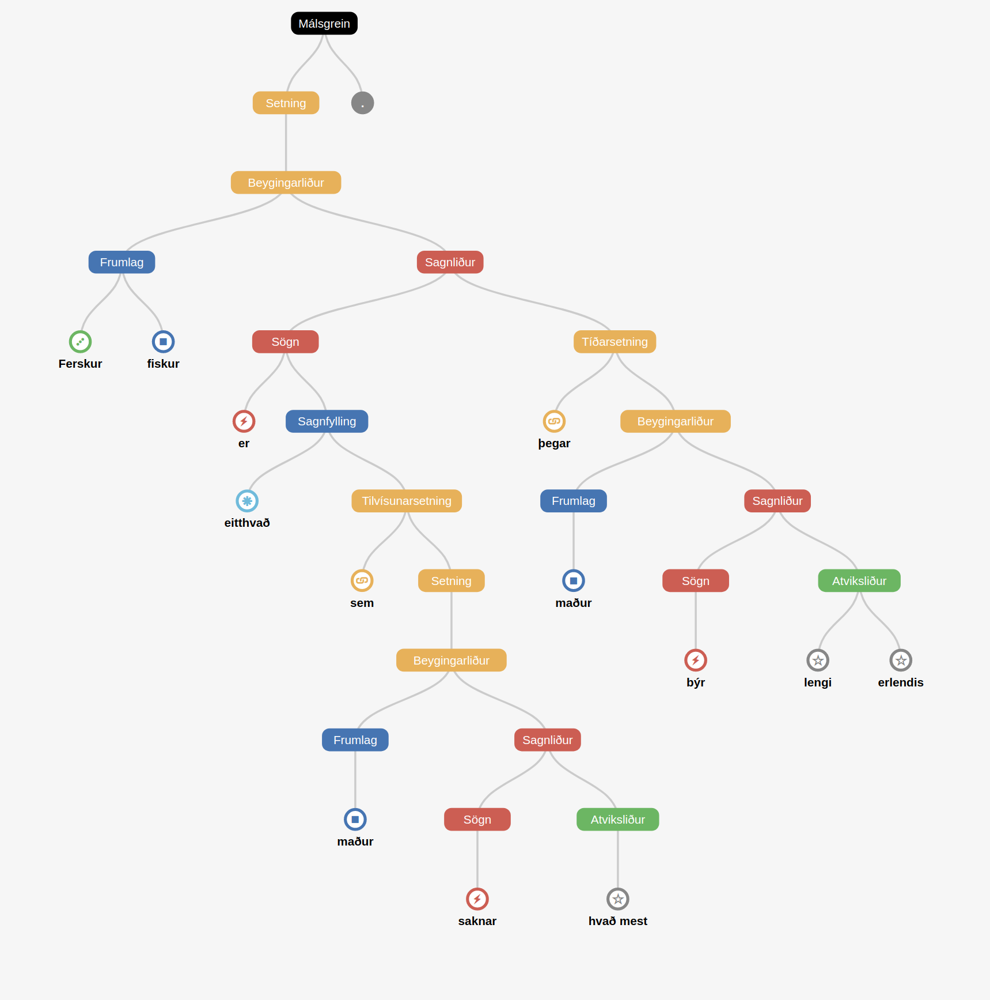

.. Greynir documentation master file, created by
   sphinx-quickstart on Sun Apr  8 01:20:08 2018.
   You can adapt this file completely to your liking, but it should at least
   contain the root `toctree` directive.

Welcome to Greynir
==================

*Til að gagnast sem flestum er skjölun Greynis á ensku. - In order to serve
the widest possible audience, Greynir's documentation is in English.*

Greynir is a Python 3.x package for **working with Icelandic text**,
including parsing it into **sentence trees**, finding **lemmas**,
inflecting **noun phrases**, assigning **part-of-speech tags** and much more.

Greynir's sentence trees can *inter alia* be used to extract information
from text, for instance about people, titles, entities, facts, actions
and opinions.

   Greynir is the engine of `Embla <https://embla.is>`_ and `Greynir.is <https://greynir.is>`_.

Greynir has been used to parse text from Icelandic news websites since 2015,
processing over 10 million sentences in over 515.000 articles. Its
optimized C++ parsing core is fast and efficient enough to parse
real-world text according to a
`context-free grammar for the Icelandic
language <https://github.com/mideind/GreynirPackage/blob/master/src/reynir/Greynir.grammar>`_
with over 21,000 productions.

To get acquainted with Greynir, we recommend that you start with
the :ref:`overview`, proceed with the :ref:`installation` instructions,
and then look at the :ref:`quickstart`. For further reference, consult
the :ref:`reference` section.

This documentation also contains :ref:`important information about copyright
and licensing <copyright>`.

Batteries included
------------------

To start using Greynir with Python, you (usually) need
:ref:`ony one command <installation>`::

   $ pip install reynir

**No database to set up, no further data to download.**
The entire `Database of Modern Icelandic
Inflection <http://bin.arnastofnun.is/DMII/>`_
(`Beygingarlýsing íslensks nútímamáls <http://bin.arnastofnun.is>`_),
with over 6 million entries, is embedded within Greynir in compressed form.
By looking up word forms in this database and applying context-free
grammar rules (productions) and scoring heuristics, Greynir is able to
infer what the most likely lemmas are, how they are inflected in the
parsed text, and where they fit in the overall sentence structure.

Greynir is thoroughly documented, and its source code is of course
`available on GitHub <https://github.com/mideind/GreynirPackage>`_.

Enabling your application
-------------------------

Greynir can serve as an enabling component of applications such as:

   * Natural language query systems
   * Bots and conversational systems
   * Information extraction tools
   * Intelligent search tools
   * Grammatical pattern analyzers
   * Text similarity
   * Author identification
   * Sentiment analysis
   * Content summarization
   * Content category labeling
   * Part-of-speech (POS) taggers and lemmatizers
   * Generation of training corpora for machine learning

About Greynir
-------------

Greynir is a project and product of Miðeind ehf. of Reykjavík, Iceland.
It is a free open source software project (:ref:`MIT license <copyright>`),
started in mid-2015 by its original author, Vilhjálmur Þorsteinsson.
Its aim is to produce an **industrial-strength Natural Language**
**Processing toolset for Icelandic**, with the hope of supporting the
language on the digital front in times of rapid advances in language
technology; changes that may leave low-resource languages at a
disadvantage unless explicit action is taken to strengthen their position.

Greynir and associated projects received grants from the Icelandic
Language Technology Fund *(Máltæknisjóður)* in 2016 and 2017.

.. toctree::
   :maxdepth: 1
   :hidden:

   overview
   installation
   quickstart
   reference
   patterns
   nonterminals
   terminals
   copyright

