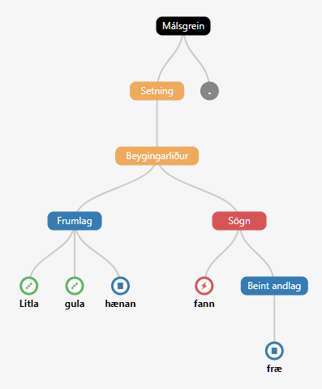

.. _overview:

Overview
========

**Reynir** parses sentences of Icelandic text into **parse trees**.
A parse tree recursively describes the grammatical structure
of the sentence, including its noun phrases, verb phrases,
prepositional phrases, etc.

The individual tokens (words, numbers, punctuation, etc.) of the sentence
correspond to leaves in the parse tree.

    *The parse tree for the sentence "Litla gula hænan átti fræ".*

By examining and processing the parse tree, information and meaning
can be extracted from the sentence.

Example
-------

Here is a short example of what can be done with Reynir::

    >>> from reynir import Reynir
    >>> r = Reynir()
    >>> job = r.submit("Ása sá sól.")
    >>> sent = next(job.sentences())
    >>> sent.parse()
    True
    >>> print(sent.tree.view)
    P                             # Root
    +-S-MAIN                      # Main sentence
      +-IP                        # Inflected phrase
        +-NP-SUBJ                 # Noun phrase, subject
          +-no_et_nf_kvk: 'Ása'   # Noun, singular, nominative, feminine
        +-VP                      # Verb phrase
          +-so_1_þf_et_p3: 'sá'   # Verb, 1 accusative arg, singular, 3rd p
          +-NP-OBJ                # Noun phrase, object
            +-no_et_þf_kvk: 'sól' # Noun, singular, accusative, feminine
    +-'.'                         # Punctuation
    >>> sent.tree.nouns
    ['Ása', 'sól']
    >>> sent.tree.verbs
    ['sjá']
    >>> # Show the subject noun phrase
    >>> sent.tree.S.IP.NP_SUBJ.lemmas
    ['Ása']
    >>> # Show the verb phrase
    >>> sent.tree.S.IP.VP.lemmas
    ['sjá', 'sól']
    >>> # Show the object of the verb
    >>> sent.tree.S.IP.VP.NP_OBJ.lemmas
    ['sól']

Here, ``S`` stands for sentence *(málsgrein)*, ``IP`` for inflected phrase *(beygingarliður)*,
``VP`` is a verb phrase *(sagnliður)*, ``NP_SUBJ`` is a subject noun phrase *(frumlag)* and
``NP_OBJ`` is an object noun phrase *(andlag)*.
Nonterminal names are listed in the :ref:`nonterminals` section.

What Reynir does
----------------

Reynir starts by **tokenizing** your text, i.e. dividing it up into individual words,
numbers, punctuation and other tokens. For this, it uses the separate
`Tokenizer <https://github.com/vthorsteinsson/Tokenizer>`_ package, by the
same authors, which is automatically installed with Reynir.

After tokenization, Reynir proceeds to **parse** the text according to a
`context-free grammar <https://github.com/vthorsteinsson/ReynirPackage/blob/master/src/reynir/Reynir.grammar>`_
for the modern Icelandic language. This grammar contains rules describing how sentences and
the various subparts thereof can be validly constructed.

Almost all sentences are **ambiguous**. This means that there are multiple parse trees
that can validly describe the sentence according to the grammar rules. Reynir thus has
to choose a single best tree from the forest of possible trees. It does this with a scoring
heuristic which assigns higher scores to common word forms and grammatical constructs, and lower
scores to rare word forms and uncommon constructs. The parse tree with the highest overall
score wins and is returned from the ``parse()`` function.

Once the best parse tree has been found, it is available for various kinds of **queries**.
You can access word lemmas, extract noun and verb phrases as shown above, look for
patterns via wildcard matching, and much more. This is described in detail in the
:ref:`reference`.

